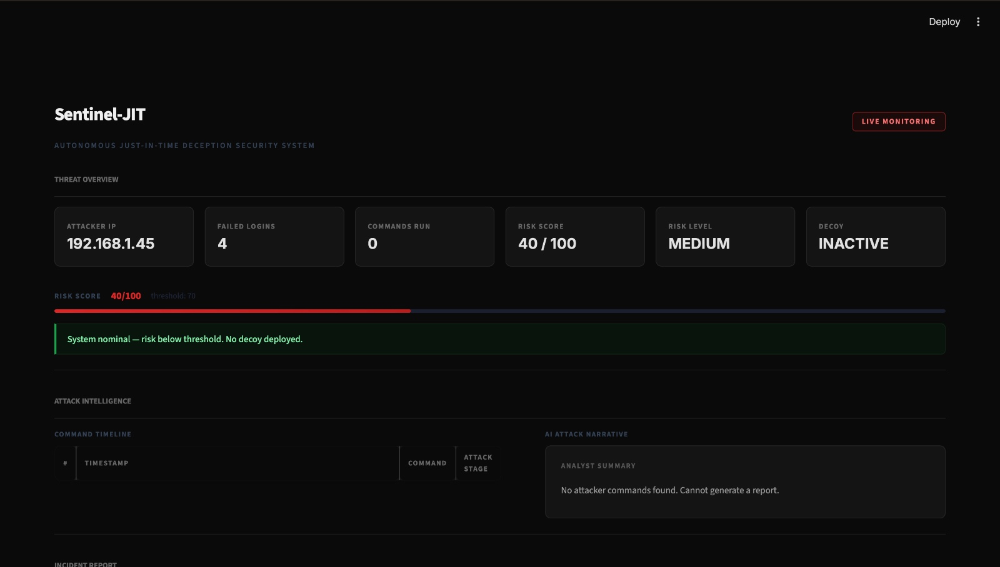
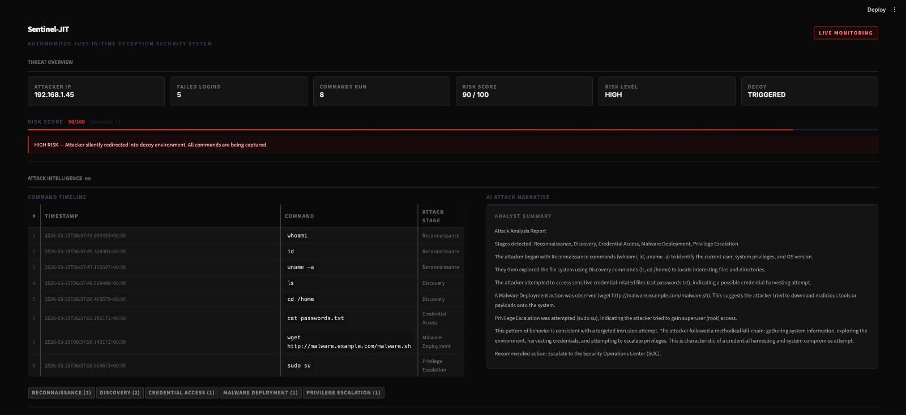
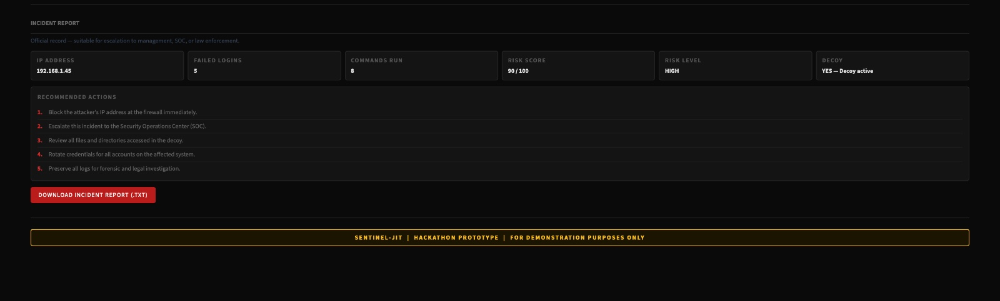

<h1 align="center">Sentinel-JIT</h1>

<b>Autonomous Just-In-Time Deception Security System</b>

**Sentinel-JIT** is a cybersecurity prototype that studies attackers instead of immediately blocking them.

Traditional systems block threats instantly, which prevents defenders from understanding attacker intent. Sentinel-JIT deploys a controlled decoy environment when suspicious activity is detected, allowing the attacker to continue interacting while their behavior is logged and analyzed.

The system then generates structured intelligence reports describing the attacker’s activity and objectives.

# How It Works ?

This approach prioritizes threat intelligence collection rather than immediate blocking.

# Dashboard Features

The Streamlit dashboard provides:

**• Threat Overview**
Displays source IP, failed login count, command activity, risk score, and decoy trigger status.

**• Command Timeline**
Interactive table showing attacker commands and classified attack stages.

**• AI Attack Analysis**
Narrative report describing attacker behavior.

**• Incident Report Export**
Downloadable report summarizing the attack session.

# Future Improvements

Possible directions for extending the system:

1. Real SSH or web-server log ingestion
2. Real-time monitoring dashboard
3. Geo-IP attacker location mapping
4. Multi-attacker session tracking
5. Automated PDF incident reports

## Project Structure

| File | Description |
|------|-------------|
| app.py | Main entry point for the Sentinel-JIT system. |
| risk_engine.py | Calculates risk scores for suspicious events. |
| alert_engine.py | Sends alerts when high-risk activity is detected. |
| ai_analysis.py | AI-based analysis of attacker commands and logs. |
| attack_simulator.py | Simulates attacker behavior for testing. |
| live_sim.py | Runs live interaction between attacker simulation and system. |
| run_demo.py | Demonstrates the full attack detection workflow. |
| run_dashboard.sh | Starts the monitoring dashboard. |
| UNDERSTANDING.md | Documentation explaining system architecture. |

## 📊 Output Demonstration

Sentinel-JIT continuously monitors suspicious activity, calculates a risk score, and automatically deploys a decoy environment when the risk threshold is exceeded.  
The following screenshots demonstrate the system behavior during different stages of an attack.

---

### 1️⃣ Normal Monitoring State

<table>
<tr>
<td width="60%">

</td>
<td width="40%">

**System Status**

- Attacker IP detected
- Failed login attempts tracked
- Risk score calculated
- Risk level classification
- Decoy environment status

When the risk score is **below the threshold**, the system remains in monitoring mode and **no decoy is deployed**.

</td>
</tr>
</table>

---

### 2️⃣ Decoy Deployment Trigger

<table>
<tr>
<td width="60%">

</td>
<td width="40%">

**Automated Response**

When suspicious activity increases:

- Risk level escalates to **HIGH**
- System automatically **deploys a decoy environment**
- Attacker is **silently redirected**
- All commands are **captured and logged**
- Security team receives **alerts**

</td>
</tr>
</table>

---

### 3️⃣ Attack Intelligence & Incident Report

<table>
<tr>
<td width="60%">

</td>
<td width="40%">

**Threat Intelligence Generated**

The system analyzes attacker behavior and produces:

- Command execution timeline
- Attack stages detected
- AI-generated analyst report
- Malware activity detection
- Recommended incident response actions

Attack stages identified may include:

- Reconnaissance  
- Discovery  
- Credential Access  
- Malware Deployment  
- Privilege Escalation  

</td>
</tr>
</table>

---
